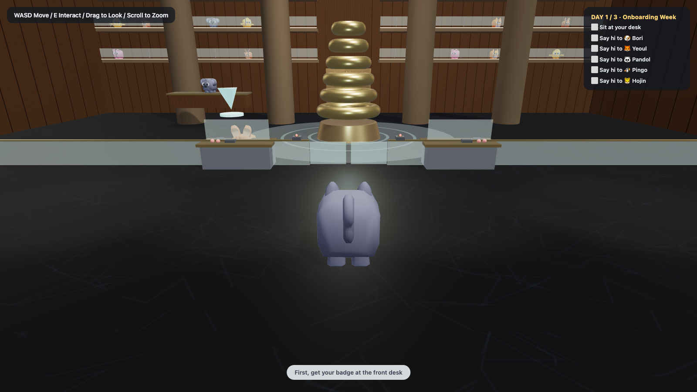
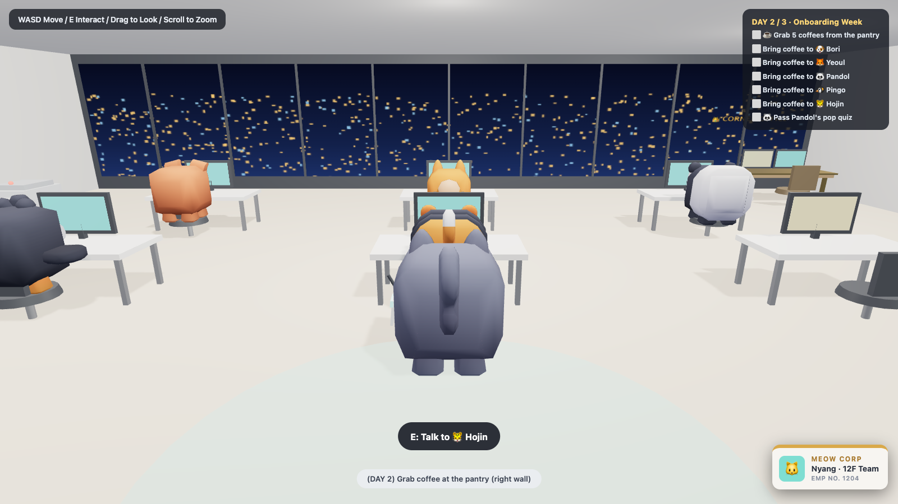
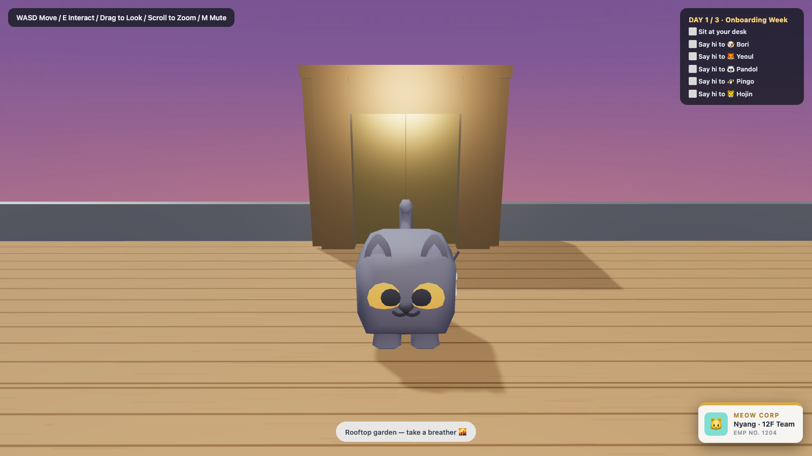

# 🐱 MEOW CORP HQ — Onboarding Week

A cozy 3D browser game about a cat's first week at the office. Badge in at the gate, ride the elevator to the 12th floor, meet your animal coworkers, deliver coffee, survive crunch night, and earn the corner office.

**▶ [Play it here](https://gridnflow.github.io/kitty_onboarding/)** — no install, runs in any desktop browser.

| Lobby | Your team on 12F | Rooftop garden |
|---|---|---|
|  |  |  |

## How to play

| Input | Action |
|---|---|
| `W A S D` | Move |
| `E` | Interact (badge, gate, elevator, talk, sit…) |
| Mouse drag / scroll | Orbit camera / zoom |
| Click | Collect figurines on the lobby shelves |
| `F` | Figurine collection |
| `M` | Mute |

## A full week of onboarding

- **Day 1 · First Day** — get your badge, tag the gate, find your desk, and meet the team. Listen closely: their intros hide company facts.
- **Day 2 · Coffee Run** — deliver coffee (earn ❤️ affinity) and pass the PM's pop quiz.
- **Day 3 · Final Exam** — fix the copier, ace the final quiz, and claim the **corner office** 👑.
- **Day 4–7** — all-hands on the rug, a design review, a dark crunch night, and Friday retro one-on-ones.
- Visit the **rooftop garden** any time — your closest coworker might be up there watching the sunset.
- Befriend Pingo (❤️×3) for a personal side quest, and collect all **24 shelf figurines**.

Progress saves automatically in your browser.

## Running locally

No build step. Clone and open `index.html` — that's it. (Everything, including 3D models and sounds, is embedded; classic scripts keep `file://` double-click working.)

```
git clone https://github.com/gridnflow/kitty_onboarding.git
open kitty_onboarding/index.html
```

Dev query params: `?office` (start on 12F) · `?roof` · `?day=N` · `?yaw=3.14` · `?autoride` (elevator self-test).

## Tech

- [Three.js](https://threejs.org/) r147 (UMD build, no bundler)
- Single-page vanilla JS split into `js/data.js` (all content), `js/engine.js`, `js/world.js`, `js/game.js`
- All assets embedded as base64 for zero-dependency hosting

## Credits

- **[Kenney](https://kenney.nl/)** (CC0): Cube Pets, Modular Buildings, Nature Kit, Interface Sounds
- **Three.js** (MIT)

Built with [Claude Code](https://claude.com/claude-code). See `ROADMAP.md` / `DEVELOPMENT_PLAN.md` for architecture notes and future plans.
